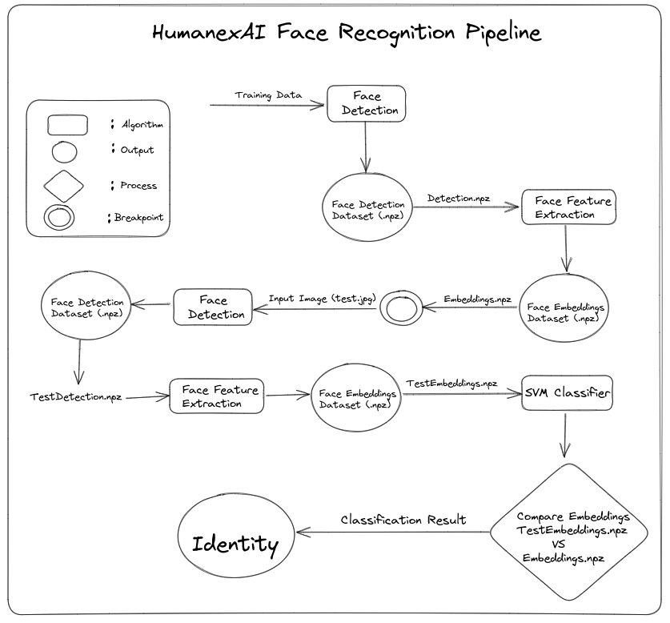

# HumanexAI Face Recognition

This project is a face recognition system powered by HumanexAI and coded by Ahmad Jawabreh, it uses MTCNN algorithm for face detection, FaceNet for feature extraction, and SVM for classification and identification. The system is able to detect and recognize faces in real-time video streams or still images, and can be customized to work with different datasets or classifiers, the algorithm giving accuracy of 99.63% on LFW dataset.

## Features
* MTCNN-based face detection: The system uses the MTCNN (Multi-Task Cascaded Convolutional Networks) algorithm for face detection, which is a popular and accurate method for detecting faces in images or videos.

* FaceNet-based feature extraction: The system uses FaceNet, a deep learning model for face recognition, to extract facial features from the detected faces. These features are then used for classification and identification.

* SVM-based classification: The system uses Support Vector Machines (SVM) for classification and identification of faces. SVM is a powerful and widely used algorithm for classification tasks, and is well-suited for face recognition applications.

* Real-time video stream processing: The system is able to process real-time video streams and detect/recognize faces in real-time.

* Customizable: The system can be customized to work with different datasets or classifiers, depending on the user's requirements.
## HumanexAI Face Recognition System Pipeline

To commence the training process, we must first prepare the training data. For instance, if we have three individuals representing three distinct classes, we will create a central file named "Data" to store all the training data. Within this file, we will have a dedicated file for each individual's (class's) data. For example, suppose we have individuals named Ahmad, Hassan, and Asad. In that case, the file structure would be organized as Data/Ahmad - Hassan - Asad. After executing the train.py file, we will receive two outputs, a .npz file containing the detected faces, and another .npz file containing the embeddings of these faces. The embeddings file is a numerical vector that represents the unique features of an individual's face. This high-dimensional vector captures the distinct characteristics of a face such as the distance between the eyes, nose, and mouth. The embeddings are generated using a deep neural network that has been trained on a large amount of face data. These embeddings are used to compare and measure the similarity of different faces. In a face recognition system, the embeddings file is commonly used as an input to a classifier, such as an SVM or KNN, to verify or identify individuals based on their facial features. The figure below illustrates training and testing process.





## Use Case
* Survillance Systems 
* Biometric Passport
* Biometric Door Lock Systems
 


## Requirements
* Python 3.7.x
* Pillow
* matplotlib
* mtcnn
* tensorflow
* scikit-learn
* keras
* keras.models

## Installation
1. Clone this repository:
```bash
git clone https://github.com/username/repo-name.git
```

2. Install the required libraries::
```bash
pip install -r requirements.txt
```

3. Run the face recognition system:
```python
python Test.py
```

## Contributing
Contributions are welcome! If you find any issues or bugs, or if you have any suggestions for improving the system, please open an issue or submit a pull request.

## License
This project is licensed under the MIT License.
